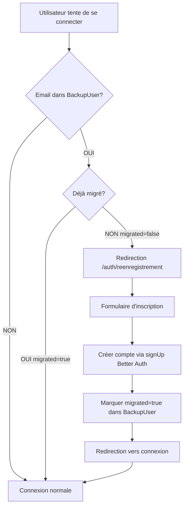

# 🔐 Migration vers Better Auth - Documentation Complète

## 📋 Vue d'ensemble

Ce système permet de **migrer progressivement** les utilisateurs de l'ancien système d'authentification JWT vers Better Auth, **sans perdre de données** et sans demander l'ancien mot de passe.

## 🎯 Approche Adoptée

Au lieu de modifier directement les comptes Better Auth (qui causait des erreurs), nous utilisons une **table de backup** pour gérer la migration de façon propre et sécurisée.

## 🏗️ Architecture

### Tables Utilisées

1. **`user`** - Table principale des utilisateurs (Better Auth)
2. **`account`** - Table des credentials Better Auth  
3. **`backup_user`** ✨ *NOUVELLE* - Table temporaire pour la migration

```sql
CREATE TABLE backup_user (
  id VARCHAR(255) PRIMARY KEY,
  email VARCHAR(255) UNIQUE NOT NULL,
  name VARCHAR(255),
  password VARCHAR(255),  -- Ancien hash (pour référence)
  type VARCHAR(50),        -- CANDIDAT, RECRUTEUR, COLLABORATEUR
  userData TEXT,           -- JSON avec toutes les données
  migrated BOOLEAN DEFAULT FALSE,  -- true quand réenregistré
  migratedAt DATETIME,
  createdAt DATETIME,
  updatedAt DATETIME
);
```

## 🔄 Flux de Migration

### Étape 1 : Migration Initiale (UNE SEULE FOIS)

```bash
# Migrer tous les utilisateurs actuels vers BackupUser
node scripts/migrate-to-backup.js
```

**Résultat** : 318 utilisateurs migrés ✅

### Étape 2 : Flux Utilisateur



## 📁 Fichiers Créés/Modifiés

### ✨ Nouveaux Fichiers

```
prisma/schema.prisma                            # Ajout modèle BackupUser
scripts/migrate-to-backup.js                    # Script de migration
scripts/check-all-accounts.js                   # Vérification des comptes
scripts/fix-all-accounts.js                     # Correction des IDs invalides
scripts/debug-users-accounts.js                 # Débogage
app/auth/reenregistrement/page.tsx             # Page de réenregistrement
app/api/auth/check-backup-user/route.ts        # API vérification backup
app/api/auth/mark-migrated/route.ts            # API marquage migration
MIGRATION_BETTER_AUTH_README.md                 # Ce fichier
```

### 🔧 Fichiers Modifiés

```
app/auth/recruteur/connexion/page.tsx          # Vérification BackupUser
app/auth/candidat/connexion/page.tsx           # Vérification BackupUser
```

## 🧪 Tests

### Test 1 : Ancien Utilisateur (Non Migré)

```
Email: ylsixtech@gmail.com (dans BackupUser, migrated=false)

1. Va sur /auth/recruteur/connexion
2. Entre email + mot de passe (n'importe lequel)
3. ✅ Redirigé vers /auth/reenregistrement?email=ylsixtech@gmail.com
4. Remplit le formulaire d'inscription
5. ✅ Compte créé via Better Auth
6. ✅ BackupUser.migrated = true
7. Peut maintenant se connecter normalement
```

### Test 2 : Nouvel Utilisateur

```
Email: nouveau@example.com (PAS dans BackupUser)

1. Va sur /auth/recruteur/connexion
2. Entre email + mot de passe
3. ✅ Connexion normale via Better Auth
4. Si compte n'existe pas → Erreur "Identifiants incorrects"
5. Doit s'inscrire normalement
```

### Test 3 : Ancien Utilisateur (Déjà Migré)

```
Email: ylsixtech@gmail.com (dans BackupUser, migrated=true)

1. Va sur /auth/recruteur/connexion
2. Entre email + nouveau mot de passe
3. ✅ Connexion normale via Better Auth
```

## 📊 Statistiques

### Vérifier l'avancement de la migration

```bash
node scripts/check-migration-status.js
```

Ou via SQL :

```sql
SELECT 
  COUNT(*) as total,
  SUM(CASE WHEN migrated = TRUE THEN 1 ELSE 0 END) as migres,
  SUM(CASE WHEN migrated = FALSE THEN 1 ELSE 0 END) as en_attente
FROM backup_user;
```

## 🔐 Sécurité

### Pourquoi ne pas demander l'ancien mot de passe ?

1. **Incompatibilité de hash** : L'ancien système utilisait peut-être un algorithme différent
2. **Migration système** : C'est une réinitialisation forcée pour tous
3. **Vérification d'identité** : L'accès à l'email prouve l'identité

### Protection des données

- ✅ Ancien hash conservé dans `BackupUser.password` (référence uniquement)
- ✅ Nouveau hash créé par Better Auth (sécurité maximale)
- ✅ Données utilisateur préservées dans `userData` (JSON)
- ✅ Traçabilité complète avec `migratedAt`

## 🚀 Déploiement en Production

### Checklist

- [x] 1. Créer la table `backup_user`
- [x] 2. Migrer tous les utilisateurs existants
- [ ] 3. Tester avec quelques utilisateurs
- [ ] 4. Déployer en production
- [ ] 5. Communiquer aux utilisateurs (email)
- [ ] 6. Surveiller les migrations
- [ ] 7. Après 30 jours, vérifier les non-migrés
- [ ] 8. Envoyer relance aux non-migrés
- [ ] 9. Après 90 jours, nettoyer la table (optionnel)

### Communication Utilisateurs

**Email type** :

```
Objet : Action requise - Mise à jour de votre compte

Bonjour [NOM],

Suite à l'amélioration de notre système de sécurité, vous devez créer un nouveau mot de passe lors de votre prochaine connexion.

Cette opération est simple et rapide :
1. Connectez-vous sur [URL]
2. Entrez votre email
3. Créez un nouveau mot de passe sécurisé

Vos données sont entièrement préservées.

Cordialement,
L'équipe Ylsix
```

## 🛠️ Maintenance

### Nettoyer les comptes invalides

```bash
# Supprimer les mauvais comptes Better Auth
node scripts/fix-all-accounts.js
```

### Forcer la migration d'un utilisateur

```sql
UPDATE backup_user 
SET migrated = FALSE 
WHERE email = 'user@example.com';
```

### Vérifier un utilisateur spécifique

```bash
node scripts/debug-users-accounts.js
```

## 🐛 Dépannage

### Problème : Utilisateur ne peut pas se connecter

```bash
# 1. Vérifier dans BackupUser
SELECT * FROM backup_user WHERE email = 'user@example.com';

# 2. Vérifier dans User
SELECT * FROM user WHERE email = 'user@example.com';

# 3. Vérifier dans Account
SELECT * FROM account WHERE accountId = 'user@example.com';
```

### Problème : Email "existe déjà"

L'utilisateur a peut-être déjà un compte Better Auth. Vérifier :

```sql
SELECT * FROM user WHERE email = 'user@example.com';
```

Si le compte existe, marquer comme migré :

```sql
UPDATE backup_user 
SET migrated = TRUE, migratedAt = NOW() 
WHERE email = 'user@example.com';
```

## 📈 Métriques

### KPIs à surveiller

- **Taux de migration** : `migrated / total * 100`
- **Temps moyen de migration** : Différence entre première connexion et réenregistrement
- **Taux d'abandon** : Utilisateurs qui ne reviennent pas
- **Erreurs de création** : Logs des échecs de `signUp`

## 🎉 Avantages de Cette Approche

✅ **Propre** : Pas de modification directe des tables Better Auth  
✅ **Sûre** : Aucune perte de données  
✅ **Progressive** : Les utilisateurs migrent à leur rythme  
✅ **Traçable** : Historique complet dans `BackupUser`  
✅ **Réversible** : Possibilité de rollback si nécessaire  
✅ **Simple** : Better Auth gère tout automatiquement  

## 📞 Support

Pour toute question :
- Consulter les logs : `console.log` dans les API routes
- Vérifier la base de données
- Tester avec un compte de test

---

**Date de mise en place** : 14 octobre 2025  
**Version** : 2.0 (Approche BackupUser)  
**Statut** : ✅ Opérationnel


