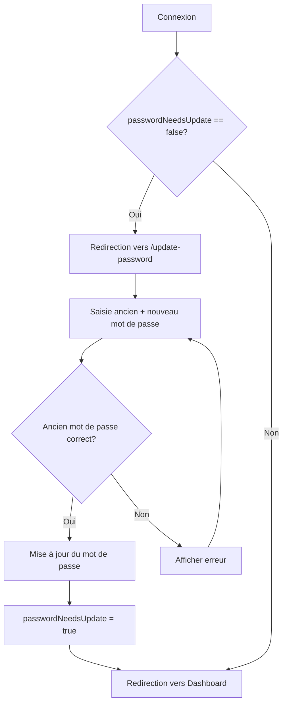
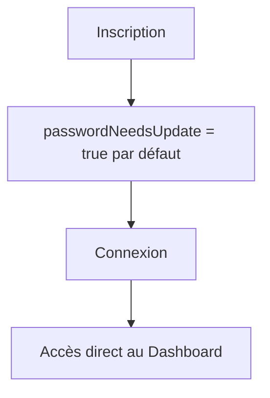

# Migration du Système d'Authentification - Guide de Mise à Jour des Mots de Passe

Ce document explique le système de mise à jour forcée des mots de passe lors de la migration de JWT vers Better Auth.

## 📋 Vue d'ensemble

Le système force les anciens utilisateurs à mettre à jour leur mot de passe lors de leur première connexion après la migration. Cela garantit que tous les mots de passe sont correctement hashés selon les standards de Better Auth.

## 🔧 Composants du Système

### 1. Schema Prisma

Un nouveau champ `passwordNeedsUpdate` a été ajouté au modèle `User` :

```prisma
model User {
  // ... autres champs
  passwordNeedsUpdate Boolean @default(false)
  // ... autres champs
}
```

- **Par défaut** : `false` (l'utilisateur doit mettre à jour son mot de passe)
- **Après mise à jour** : `true` (l'utilisateur a mis à jour son mot de passe)

### 2. API Routes

#### `/api/auth/check-password-status`
Vérifie si l'utilisateur doit mettre à jour son mot de passe.

**Requête** :
```json
{
  "userId": "user_id_here"
}
```

**Réponse** :
```json
{
  "passwordNeedsUpdate": false
}
```

#### `/api/auth/force-update-password`
Met à jour le mot de passe de l'utilisateur et marque `passwordNeedsUpdate` à `true`.

**Requête** :
```json
{
  "userId": "user_id_here",
  "oldPassword": "ancien_mot_de_passe",
  "newPassword": "nouveau_mot_de_passe"
}
```

**Réponse** :
```json
{
  "success": true,
  "message": "Mot de passe mis à jour avec succès"
}
```

### 3. Page de Mise à Jour

`/update-password` - Page où les utilisateurs sont redirigés pour mettre à jour leur mot de passe.

**Fonctionnalités** :
- Validation de l'ancien mot de passe
- Confirmation du nouveau mot de passe
- Indicateurs visuels de sécurité
- Messages d'erreur clairs

### 4. Hooks et Guards

#### `usePasswordCheck`
Hook qui vérifie automatiquement le statut du mot de passe et redirige si nécessaire.

#### `PasswordCheckGuard`
Composant wrapper qui protège toutes les routes de l'application.

## 🚀 Étapes de Migration

### Étape 1 : Appliquer la Migration Prisma

```bash
# Générer la migration
npx prisma migrate dev --name add_password_needs_update

# Appliquer la migration en production
npx prisma migrate deploy
```

### Étape 2 : Marquer les Utilisateurs Existants

Pour tous les utilisateurs existants (ceux créés avant la migration), vous devez marquer leur champ `passwordNeedsUpdate` à `false` :

```sql
-- SQL direct
UPDATE user SET passwordNeedsUpdate = false WHERE createdAt < '2025-10-14';
```

Ou via Prisma :

```typescript
// Script de migration
import prisma from './lib/prisma';

async function markExistingUsers() {
  await prisma.user.updateMany({
    where: {
      createdAt: {
        lt: new Date('2025-10-14')
      }
    },
    data: {
      passwordNeedsUpdate: false
    }
  });
  
  console.log('Utilisateurs marqués pour mise à jour du mot de passe');
}

markExistingUsers();
```

### Étape 3 : Vérifier l'Installation

1. **Tester la connexion d'un ancien utilisateur** :
   - Se connecter avec un compte existant
   - Vérifier la redirection vers `/update-password`
   - Mettre à jour le mot de passe
   - Vérifier l'accès au dashboard

2. **Tester la connexion d'un nouvel utilisateur** :
   - Créer un nouveau compte
   - Se connecter
   - Vérifier l'accès direct au dashboard (pas de redirection)

## 🔐 Flux d'Utilisation

### Pour les Anciens Utilisateurs



### Pour les Nouveaux Utilisateurs



## 📝 Personnalisation

### Modifier le Délai de Vérification

Dans `usePasswordCheck.ts`, vous pouvez ajuster les chemins publics :

```typescript
const publicPaths = ["/auth/", "/update-password", "/public/"];
```

### Personnaliser la Page de Mise à Jour

Modifiez `/app/update-password/page.tsx` pour adapter :
- Le design
- Les messages
- Les règles de validation du mot de passe
- La redirection après mise à jour

### Ajouter des Règles de Mot de Passe

Dans `/app/api/auth/force-update-password/route.ts` :

```typescript
// Exemple : exiger au moins 8 caractères et un caractère spécial
if (newPassword.length < 8) {
  return NextResponse.json(
    { error: "Le mot de passe doit contenir au moins 8 caractères" },
    { status: 400 }
  );
}

if (!/[!@#$%^&*]/.test(newPassword)) {
  return NextResponse.json(
    { error: "Le mot de passe doit contenir au moins un caractère spécial" },
    { status: 400 }
  );
}
```

## 🐛 Dépannage

### L'utilisateur n'est pas redirigé

1. Vérifier que `passwordNeedsUpdate` est bien à `false` en base
2. Vérifier que le `PasswordCheckGuard` est bien dans le layout principal
3. Vérifier les logs de la console pour les erreurs

### Erreur "Ancien mot de passe incorrect"

1. Vérifier que le hash du mot de passe est correct en base
2. Vérifier que bcrypt est bien installé et fonctionnel
3. Tester avec un nouveau compte

### Redirection en boucle

1. Vérifier que la page `/update-password` est exclue des chemins protégés
2. Vérifier que `passwordNeedsUpdate` est bien passé à `true` après mise à jour

## 📊 Monitoring

Vous pouvez suivre la migration avec cette requête SQL :

```sql
-- Nombre d'utilisateurs ayant mis à jour leur mot de passe
SELECT 
  COUNT(*) as total_users,
  SUM(CASE WHEN passwordNeedsUpdate = true THEN 1 ELSE 0 END) as updated,
  SUM(CASE WHEN passwordNeedsUpdate = false THEN 1 ELSE 0 END) as pending
FROM user;
```

## ⚠️ Considérations de Sécurité

1. **Ne jamais logger les mots de passe** : Les mots de passe ne doivent jamais apparaître dans les logs
2. **HTTPS uniquement** : Assurez-vous que l'application utilise HTTPS en production
3. **Rate limiting** : Considérez l'ajout d'un rate limiting sur l'API de mise à jour
4. **Expiration de session** : Les anciennes sessions JWT doivent être invalidées

## 🔄 Rollback

Si vous devez revenir en arrière :

```sql
-- Supprimer le champ
ALTER TABLE user DROP COLUMN passwordNeedsUpdate;
```

Et retirer le `PasswordCheckGuard` du layout principal.

## 📞 Support

Pour toute question ou problème, consultez :
- La documentation de Better Auth
- Les logs de l'application
- Le support technique

---

**Date de création** : 14 octobre 2025  
**Version** : 1.0

